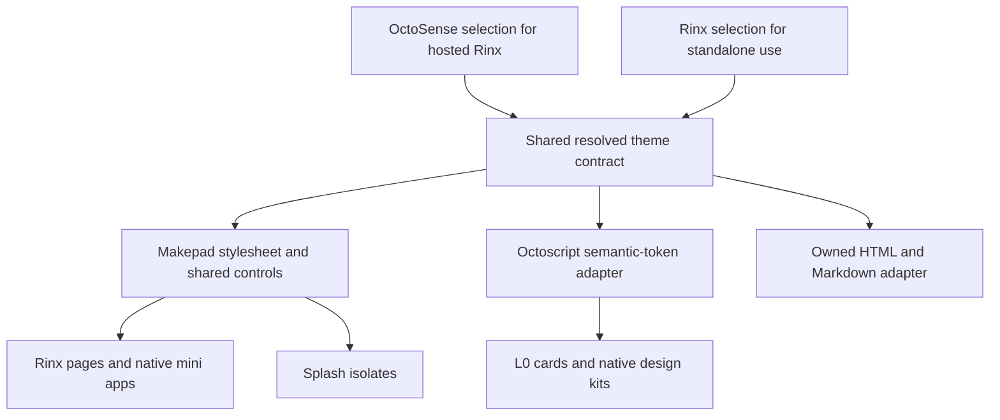

# ADR 0009: Shared reloadable themes for Rinx and mini apps

- Date: 2026-10-02
- Status: Accepted; Rinx customer-theme implementation delivered, with external
  host transports and platform/device release gates still open. See the
  [customer-theme guide](../customer-themes.md) and
  [implementation and validation scope](../theme-validation.md).
- Extends [ADR 0003](0003-shared-article-components.md),
  [ADR 0005](0005-octoscript-miniapps-matrix-octos.md),
  [ADR 0006](0006-shared-app-hub-miniapps.md),
  [ADR 0007](0007-host-owned-octos-app-peers.md), and
  [ADR 0008](0008-rinx-system-app-catalog.md).
- Aligns with the [OctoSense shared app theme contract][octosense-contract].

## Context

Rinx pages, native system apps, Octoscript mini apps, and the tabbed reader use
different styling systems. The main application has light-first `RBX_*` tokens,
legacy `COLOR_*` tokens, and literal colors. The article editor defines its own
green accent and controls. Mobile pages and browser controls contain additional
fixed palettes. Font sizes, spacing, navigation, and action hierarchy vary too.

The mini-app boundary adds another source of inconsistency. Splash runs in a
separate VM. L0 cards and native design kits load package-owned palettes and
lower their styles into explicit rendering values. A change to the host's
`mod.theme` cannot recolor those values by itself.

OctoSense already owns theme selection for hosted apps. Its `ModuleHost` installs
a Makepad stylesheet into each app isolate and reapplies it to existing widget
instances when the selection changes. Makepad's `StyleSheet` includes theme
source, widget overrides, and icons. Rinx's pinned Makepad also has Splash
restyling support that preserves edited text and script module state. These are
the foundations to reuse; application-specific migration is still necessary.

Customer themes should become a Rinx feature with predictable results across
pages and mini apps. Consistency requires shared components and layout rules as
well as shared colors. A theme must not require restarting Rinx, reopening a
mini app, or discarding a draft.

## Decision

### 1. The host owns selection; consumers share one resolved contract

| Deployment | Theme authority | Rinx behavior |
| --- | --- | --- |
| Rinx hosted by OctoSense | OctoSense's theme selection and resolved appearance | Consume the host snapshot and later revisions; expose the active theme and a route to host customization. |
| Standalone Rinx | Rinx's local appearance preferences | Resolve a theme through the same shared contract and apply it to Rinx and every hosted mini app. |
| Mini app inside Rinx | The containing Rinx instance | Inherit the resolved theme; do not create independent system-theme preferences. |

Hosted Rinx must not override the host with a saved standalone selection. Keep
the standalone selection available for a later standalone launch. Following
system light/dark appearance is distinct from receiving an OctoSense theme:
an independently installed app cannot infer an entire customer palette from an
OS dark-mode flag.

The shared contract and default derivations belong in a small versioned shared
theme dependency, coordinated with OctoSense and its Makepad runtime. Rinx must
not depend on the shell executable or a running OctoSense installation to theme
itself. Do not copy the preset catalog or implement a second renderer in Rinx.
The exact shared crate name is an implementation detail, not an existing API
claimed by this ADR.

Keep platform style family, appearance, and customer customization distinct.
Selecting a palette must not switch Android navigation to desktop navigation.

### 2. Semantic tokens and reusable controls define the design language

Use existing Makepad roles for common surfaces and controls:

| Purpose | Existing role |
| --- | --- |
| Page background | `theme.color_bg_app` |
| Card or panel | `theme.color_bg_container` |
| Input or secondary surface | `theme.color_inset` |
| Main text | `theme.color_text` |
| Accent and focus | `theme.color_focus` |
| Text on accent | `theme.color_text_on_accent` |
| Border | `theme.color_bevel_outset_2` |
| Font families | `theme.font_regular`, `theme.font_bold` |
| Corners | `theme.corner_radius`, `theme.container_corner_radius` |

Define shared semantic extensions where the existing roles are insufficient:
readable secondary text, selected surfaces, status foreground/background pairs,
and interaction states. Secondary text and disabled text are distinct roles,
even where a compatible base theme initially maps them to the same value.

Rinx-specific roles cover message surfaces, mentions, unread indicators,
presence, and code blocks. Their defaults derive from the shared theme and must
work when a customer package supplies no Rinx-specific overrides. A dark
navigation rail or code surface can be a deliberate preset choice, represented
by semantic roles rather than a permanent exception in page code.

The resolved snapshot includes a schema version, revision, selected identity,
resolved appearance, semantic colors, typography, spacing/control metrics,
corners, and motion preferences. A change of accent, font, or metrics produces
a new revision even if the style family and light/dark mode are unchanged.
Cache by revision, not just by theme name or a dark-mode boolean.

Reusable controls own hover, pressed, selected, focused, disabled, loading, and
error states. Share page headers, navigation actions, buttons, inputs, segmented
tabs, list rows, cards, dialogs, and empty states. Share typography roles,
gutters, spacing, and responsive control metrics. Chat and article text use
bounded reading widths with balanced margins; wide media and tables may have
separate layout rules. Preserve platform conventions and Chinese/English font
fallbacks. Text scaling remains distinct from the existing whole-UI zoom.

SVG icons use a consistent grid, size, and visual weight. Primary actions retain
descriptive labels alongside icons; icon-only actions need accessible names and
appropriate tooltips or touch affordances.

During migration, existing `RBX_*` and `COLOR_*` call sites may resolve through
compatibility aliases. Rust drawing code retains per-instance resolved values
instead of mirrored permanent color constants. Resolve on registration/reapply;
do not read theme files or preferences during drawing.

Reusable article controls must remain usable outside Rinx, as required by ADR
0003. Shared primitives belong below the host application; they cannot introduce
a dependency from `article-makepad` back to Rinx or the OctoSense shell.

### 3. Theme changes reapply appearance without restarting applications

Use Makepad's stylesheet installation and style-reload path. Preserve both
registration phases: theme values before base widget registration, then widget
overrides before application definitions consume those defaults. Rinx's
standalone startup currently calls `widgets_mod()` without the explicit
subsequent `desktop_style::apply_widgets()` used by framework startup; cover
that path as part of integration. Hosted registration respects the stylesheet
already installed by OctoSense.

On a new revision:

1. Resolve and validate a complete candidate using the shared contract.
2. Install it through the appropriate standalone or host-owned reload path;
   invalidate resolved-color and widget-definition caches for that revision.
3. Reapply the existing roots and propagate the same revision to child isolates,
   dynamic windows, popups, retained tabs, and list-item templates. Newly created
   widgets must receive the current revision too.
4. Reconcile affected layout and redraw. Retain the previous valid selection
   for rollback if application fails; never persist an invalid candidate as the
   startup default.

Preserve widget and application identity, input/focus/selection, scroll position,
undo history, unsaved documents, reader sessions, and mini-app state. Do not use
`Splash::set_text()` or recreate the app as a shortcut for a theme update. Reuse
stylesheet reapplication; when L0 output changes, reconcile it using stable IDs
and the existing instance store.

Splash restyling reevaluates top-level source. Makepad already handles startup
timer replacement and restoration of body-owned module state, but that is not
proof that arbitrary application side effects are safe. Theme changes must not
repeat Matrix sends, publishing, service requests, or permission prompts. Keep
initialization effects separate from rendering/reapply and test pending work.
Leases, grants, accounts, package identities, and provider contexts retain the
boundaries established by ADRs 0003, 0005, and 0007.

Runtime theme switching must work in packaged builds. Developer source-file
watching is optional; installed themes cannot depend on a source checkout path.

### 4. Mini apps consume the same theme through their rendering adapters

| Rendering path | Required integration |
| --- | --- |
| Native system apps | Shared controls and semantic roles, including custom Rust drawing values. |
| `main.splash` | Inherit the complete stylesheet in the isolate and reapply it while retaining the instance. |
| L0 `page.card` | Supply the active semantic theme to realization/lowering and reconcile changes with stable IDs and `InstanceStore`. |
| Native design kits | Preserve semantic token bindings through the kit/renderer contract instead of freezing every role into a package palette. |
| Owned HTML | Generate controlled CSS defaults from the same resolved snapshot. |

The shared Octoscript runtime owns generic semantic bindings and lowering. Rinx
owns propagation into its instances. Generated mini apps should reference roles
rather than embed the colors active at generation time. The rendering contract
must distinguish semantic references from intentional literal content colors;
post-processing equal RGB values cannot recover that distinction.

New first-party apps follow the host by default. Existing packages need an
explicit compatibility path: their literal palettes cannot be assumed to follow
the host. Version the shared theme support and migrate old kits without breaking
existing bundles. Any manifest extension must be agreed with the shared app
contract; this ADR does not invent a supported manifest field.

Host appearance overlays must not rewrite installed or frozen bundle files,
change their verified digests, or grant additional capabilities. Theme-dependent
render caches include the theme revision separately from package identity.
Keep toolkit changes in the owning runtime repository and update consumer pins
after compatibility checks; avoid a private Rinx fork of the renderer.

### 5. App appearance and authored document style are separate

Article document themes remain part of the document model and publication.
Changing app appearance must not rewrite a saved article, Matrix publication,
or another person's authored colors.

- Editor controls, browser tabs, and reader chrome follow app appearance.
- Plain Markdown uses shared reading defaults, including text, links, code,
  tables, selection, and width.
- Authored articles retain their document style. An optional reading appearance
  override affects the local presentation, not the stored document.
- Owned HTML uses semantic CSS values while preserving meaningful content
  colors. Changing appearance should retain reading position.
- External websites retain their own styles. Rinx themes their surrounding
  controls and may communicate supported appearance preferences; it does not
  promise to recolor every website.

Use the product terms "App appearance" and "Document style" to distinguish the
two settings. Charts, media, brand artwork, and other authored content can have
documented literal colors without becoming independent app themes.

### 6. Customer themes are versioned data with preview and recovery

Provide presets, System/Light/Dark appearance, supported accent and metric
customization, and a live preview showing chat, a mini app, a form, and a reader.
Support duplicate/edit, apply, undo, reset, import/export, and sharing through
Rinx. Hosted customization uses the shared OctoSense authority. Standalone Rinx
uses the same contract locally.

Customer packages contain versioned metadata, a compatible base, appearance
variants, and typed semantic overrides. Use a documented subset of the
[DTCG token format][dtcg-format] for portable values/references where practical;
the [resolver specification][dtcg-resolver] informs variant resolution. These
are interchange conventions, not a replacement for Makepad's runtime.

Validate schema compatibility, reference cycles, value types/ranges, resource
references, and required foreground/background contrast. Inherit omitted roles
from the compatible base. Reject unsupported required features without partially
applying a package. Fonts/icons resolve through admitted resources. Customer
data compiles to trusted stylesheet definitions; importing a theme must not
evaluate arbitrary downloaded Splash, shaders, or host requests.

Keep a known-good bundled fallback and a recoverable previous selection.
Receiving a shared theme offers preview and explicit application; receipt alone
does not change appearance. Theme sharing uses existing attachment mechanisms
and confers no mini-app permissions. Catalog publication, account synchronization,
and organization policy are separate follow-up scope, not prerequisites for
local custom themes.

## Ownership and compatibility

| Owner | Responsibility |
| --- | --- |
| OctoSense/shared theme dependency | Canonical contract, shared preset data/defaults, host selection, resolved revisions. |
| Makepad runtime | Stylesheet registration/reapply, widget state retention, platform font/style behavior. |
| Octoscript/Octoscript-Makepad | Portable semantic bindings, L0 and native-kit lowering, runtime compatibility. |
| Rinx | Standalone selection, host integration, Rinx roles/components, page migration, instance/window propagation, customer-theme UI. |
| Article components and renderer adapters | Reusable themed controls and reading defaults while retaining document style and host independence. |

Rinx and current OctoSense use different pinned Makepad and Octoscript revisions.
Choose and validate a coherent dependency graph for hosted integration. Do not
silently repin unrelated runtime dependencies during a page styling change.

The contract is portable across supported desktop, Android, iOS, OpenHarmony,
and Web builds; this is an architectural requirement, not device verification.
Separate app processes need an initial snapshot and a subscription/revision
transport. OctoSense's inspected contract explicitly identifies the separate
Android APK adapter as unfinished. OpenHarmony and other deployment adapters
must also be verified rather than inferred from in-process module support.

## Migration plan

Deliver the work as six reviewable changes, splitting large migrations further
when necessary. Build the native reference gallery and regression fixtures in
the first change, and extend them throughout the rollout.

| Change | Deliverable | Exit criterion |
| --- | --- | --- |
| 1. Theme runtime and contract | Shared schema/roles, selection ownership, complete stylesheet registration, revision propagation, reference fixtures. | Standalone and hosted fixtures consume the resolved theme and keep live instances through a change. |
| 2. Tokens and controls | Compatibility aliases, per-instance Rust values, shared controls, type/spacing/icon rules. | The component gallery covers light, dark, custom accents, interaction states, and text scaling. |
| 3. First complete user flow | Mini-app catalog/library, details, permissions, and article editor use the shared design language. | Mini Apps to Article Editor is visually consistent and retains a draft during live restyling. |
| 4. Octoscript integration | Semantic host-theme inputs for L0/design kits, Splash propagation, updated SDK examples and legacy compatibility. | Open sample mini apps follow host revisions without state loss or repeated requests. |
| 5. Remaining pages and readers | Chat, settings, contacts, Moments, dialogs, previews, secondary windows, and document defaults. | The audited page inventory has no unexplained fixed interface palettes or inconsistent common controls. |
| 6. Customer theme experience | Customization, preview/undo, versioned import/export, recovery, and sharing. | A customer theme applies consistently across native pages, mini apps, and owned document surfaces. |

The blank App Hub page observed in the offline signed-out audit needs a focused
navigation/visibility fix before that flow can serve as a reference fixture. It
is a separate prerequisite defect, not evidence that theme migration is done.

## Validation and release criteria

Use Makepad native instrumentation with isolated profiles and hidden windows.
Capture rendered output and widget measurements; source checks alone cannot
establish visual consistency. Use fixtures without production account data.

- Exercise initial launch and in-place changes for light, dark, and two presets
  with different accents but the same appearance and style family.
- Cover standalone Rinx and hosted Rinx, including two hosted instances where
  supported. Check open and inactive tabs, secondary windows, dialogs, popups,
  existing virtualized rows, and rows created after a theme change.
- Preserve chat drafts, selection/caret, focus/IME composition, scroll, article
  undo history, unsaved documents, reader sessions, and mini-app instance state.
  Verify that pending service work and script timers are not duplicated.
- Confirm that theme changes do not alter account/room grants, consent,
  installed bundle bytes/digests, saved document styles, or publication content.
- Check narrow and wide layouts, Chinese/English text, text scaling, keyboard
  navigation, focus visibility, and pointer/touch targets. Use at least 4.5:1
  contrast for normal text and 3:1 for essential control graphics, subject to
  the applicable [text][wcag-text] and [non-text][wcag-nontext] criteria. Disabled
  controls are not a justification for low-contrast ordinary supporting text.
- Test package validation, incompatible versions, cyclic references, preview
  cancellation, failed application, undo, and restart recovery. Validate both
  bundled themes and imported themes in a packaged build.
- Add a check for new unexplained UI color literals, with reviewed exceptions
  for semantic/content colors. Component changes update their visual fixtures.
- Record builds, native screenshots, and physical-device interaction separately
  per supported platform. A macOS result does not establish Android or
  OpenHarmony correctness, native accessibility, or browser behavior.

The first visible milestone completes change 3: Mini Apps to Article Editor
shares one design language across light, dark, and custom accents while retaining
an unsaved draft during a theme change. The end-to-end milestone after changes
4 and 5 includes an open chat, script mini app, unsaved article, and reader all
updating their shared controls and surfaces while retaining state. Full release
also requires the customer-theme import/recovery criteria above.

The implementation MVP includes that native flow and representative `main.splash`
and L0 samples from change 4. Its acceptance gate is live switching between light,
dark, and two accents of the same appearance in standalone and hosted fixtures,
with native screenshots and assertions for unchanged drafts, selection, focus,
scroll, instance identity, and service/timer counts. This does not claim that all
legacy kits or pages have migrated. The customer theme editor, import/export,
and sharing remain change 6. Device validation is recorded separately from
desktop instrumentation.

## Alternatives considered

- Recolor only `RBX_*`: leaves literal styles, native mini apps, and lowered
  Octoscript kits outside the change; does not unify component behavior.
- Give every mini app its own theme picker: creates competing preferences and
  contradicts the OctoSense host contract.
- Replace matching colors in generated output: loses semantic distinctions and
  risks altering authored content; use semantic bindings before lowering.
- Restart apps on theme selection: loses interaction state and risks repeated
  service effects; use existing reapply and reconciliation mechanisms.
- Inject CSS into every webpage: cannot cover native UI and can damage authored
  website presentation; restrict adapters to controlled content and chrome.
- Build a Rinx-specific theme engine: duplicates Makepad and OctoSense behavior
  and creates another compatibility boundary to maintain.

## Consequences

Customer themes gain consistent reach across Rinx and participating mini apps.
Shared controls reduce repeated styling work, and host ownership makes the same
application compatible with standalone and OctoSense deployments. Existing
document styles, package verification, and service authority remain independent
of appearance.

Migration spans Rinx and the shared runtime repositories. Legacy literal-based
apps require explicit migration; arbitrary imported UI cannot be claimed theme
compliant. A common palette does not prove good layout, so visual review and
state-preservation checks remain release requirements. Cross-process transport
and untested platforms require additional integration work.

## Research baseline and implementation record

The 2026-10-02 review used:

| Source | Revision |
| --- | --- |
| Rinx main | `5e246492dde5cd77c8b60666da4842c58840e06b` |
| OctoSense main | `bf3c21809b1d76994a039e6372ba0b46093a49df` |
| Rinx Makepad pin | `1f3b1dedfbb81424eb8dbf69e5e2c634fa73dc54` |
| OctoSense Makepad pin | `c155f61d0e1600d2ec474209374444a38a09a470` |
| Rinx Octoscript-Makepad pin | `cb66de073469063abeb2a5ab2a2bbf3cdb365745` |
| OctoSense Octoscript-Makepad pin | `2cc5ef37d7d6a3d2992673389ce74488f7bb2d87` |

Relevant Rinx paths are [application registration](../../src/app.rs),
[design tokens](../../src/shared/design_tokens.rs),
[legacy styles](../../src/shared/styles.rs),
[mini-app hosting](../../src/miniapps/ui.rs),
[the library](../../src/miniapps/library.rs),
[article UI](../../apps/article-editor/native/ui.rs), and
[reader controls](../../src/shared/web_browser.rs). Upstream references include
[OctoSense ModuleHost][module-host], [Makepad stylesheet handling][stylesheet],
[Splash restyling and tests][splash], and [Octoscript palette assembly][l0].

The offline `system_app_catalog` example was rebuilt using
`cargo build --profile fast --example system_app_catalog --locked`. Native
instrumentation captured 12 screenshots using fresh default, `macos`, and
`macos-dark` launches on macOS, with hidden windows and separate signed-out
profiles. Dark buttons retained a light catalog background; article details
retained their light/green palette. Opening App Hub produced a blank area in
that harness. Signed-in production reproduction was not attempted.

Local audit output is under `target/theme-ux-audit-20261002/` and is not a
versioned repository artifact. These captures are a baseline, not an in-place
theme-switching test. No Android, OpenHarmony, iOS, Linux, Windows, or Web run is
claimed. This ADR introduces documentation only. Implementation PRs must append
their actual validation results and update the status and ADR index accordingly.

[octosense-contract]: https://github.com/OctoSense-org/OctoSense/blob/bf3c21809b1d76994a039e6372ba0b46093a49df/phone/docs/android/app-theme-contract.md
[module-host]: https://github.com/OctoSense-org/OctoSense/blob/bf3c21809b1d76994a039e6372ba0b46093a49df/crates/shell/src/module_host.rs
[stylesheet]: https://github.com/OctoSense-org/makepad/blob/1f3b1dedfbb81424eb8dbf69e5e2c634fa73dc54/widgets/src/desktop_style.rs
[splash]: https://github.com/OctoSense-org/makepad/blob/1f3b1dedfbb81424eb8dbf69e5e2c634fa73dc54/widgets/src/splash.rs
[l0]: https://github.com/OctoSense-org/Octoscript-Makepad/blob/2cc5ef37d7d6a3d2992673389ce74488f7bb2d87/crates/octoscript-makepad/src/l0.rs
[dtcg-format]: https://www.designtokens.org/tr/2025.10/format/
[dtcg-resolver]: https://www.designtokens.org/tr/2025.10/resolver/
[wcag-text]: https://www.w3.org/WAI/WCAG22/Understanding/contrast-minimum.html
[wcag-nontext]: https://www.w3.org/WAI/WCAG22/Understanding/non-text-contrast.html
