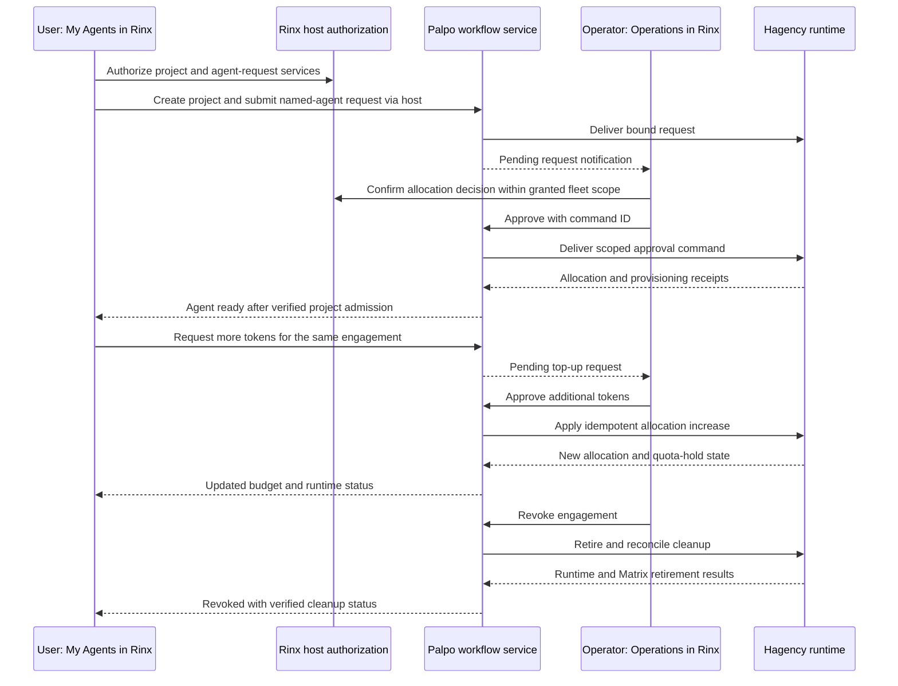

# ADR 0010: Palpo and agent administration through Rinx OctoScript mini apps

> **Superseded in part by [ADR 0011](0011-hagency-server-engagements.md).**
> Its Rust backend migration, Hagency-originated server engagements, coordinator
> approvals, profile export and allocation rules are the current product decision.
> This document retains the original source review and shared-login/Inbox design;
> historical approval tables below are not the current authority specification.

- Date: 2026-10-03
- Status: Implementation in progress. Shared-login frontend and durable Inbox
  have local native validation; administrator/owner contribution approval and
  Matrix notices also pass against live Palpo. Complete lifecycle and deployment acceptance
  remain open. See the [implementation checkpoint](../design/palpo-miniapp-implementation.md).
- Extends [ADR 0005](0005-octoscript-miniapps-matrix-octos.md),
  [ADR 0006](0006-shared-app-hub-miniapps.md),
  [ADR 0008](0008-rinx-system-app-catalog.md), and
  [ADR 0009](0009-shared-reloadable-themes.md).
- Replaces this proposal's initial choice of a compiled native admin dashboard.
  The first delivery replaces Palpo's web frontend with an OctoScript frontend
  and reuses the signed-in Rinx identity. Additional agent workflows are a
  subsequent backend feature track, not prerequisites for frontend replacement.
- The [three-stage workflow design](../design/palpo-miniapp-workflows.md)
  specifies the requested product: contribution approval and JSON handoff,
  project approval, then agent approval/management with a personal My Actions
  room inspired by OctoSense Glance, backed by the persistent Palpo Inbox.
  Frontend parity is a foundation milestone; all three stages are the product
  completion target.

## Product decision

Keep the Palpo server, its web-admin backend, stored data, business operations
and existing administrator/member checks. Replace the browser presentation with
an OctoScript mini-app frontend. Add a passwordless session adapter so people
already signed into Rinx enter as that same Matrix user, with that user's current
Palpo permissions. No separate username/password form is needed in the mini app.

People grant mini-app services through Rinx-owned authorization UI when needed;
login reuse and remembered grants do not require a new prompt on every launch.
The same flow targets desktop, Android and OpenHarmony, with platform validation
required before release.

Use the existing signed App Hub format and Splash runtime. Start with one Palpo
package, a common Inbox surfaced in a personal My Actions room, and two
role-aware areas. Separate packages remain a
distribution option without changing authentication. The pages and workflows are:

| Area | Audience and pages |
| --- | --- |
| Palpo Operations | Authorized server administrators and fleet operators: Requests, Projects, Agents, Fleets and Activity; resource approval, assignment, budget decisions and retirement within their granted scope |
| My Agents | Project owners and authorized members: My projects, My agents, Requests and Approvals; create/request an agent, inspect usage, request more tokens, exercise permitted management actions and use the agent in chat |

These are product surfaces, not new account systems. For frontend parity, keep
Palpo's existing server-admin, fleet-owner and project-membership checks. An
admin and an ordinary user follow the same login flow; the server decides which
pages/actions each may access. Neither an app manifest nor consent changes roles.

Reuse the server logic currently housed in Palpo's `web-admin` service, while
making its browser frontend optional. All replaced browser interactions must
have an in-Rinx path. Existing runtime setup requirements remain backend
requirements; improvements such as one-time pairing and remote Hagency resource
decisions belong to the extension track below. Frontend parity does not require
redesigning Hagency, a new identity provider or a new resource delegation model.

The mini apps render through OctoScript/Makepad and use ADR 0009's shared theme.
Rust code in Rinx supplies bounded host services and trusted authorization UI;
it does not implement a second copy of each application page. UI bundles can
update independently once the host contract is installed. New host capabilities
still require a compatible Rinx release. A Splash isolate is not an OS process.

## Source baseline

| Repository | Reviewed source |
| --- | --- |
| Rinx main | `3bedeadfd5a6e42cd149b89ea0b8845ee6fe48f9`; [mini-app dispatch][rinx-dispatch], [leases][rinx-leases], [catalog admission][rinx-catalog] |
| Rinx theme work | `a2e87dadf8840782de3be6eb23d573e1dfb9b07d`, [PR #57][theme-pr]; not assumed merged |
| Palpo main | `3f1ad3ba5c80a7206521b3eb4059a4f1f3786700`; [HTTP routes][palpo-http], [workflow][palpo-workflow], [service operations][palpo-service] |
| Hagency Rust main | `e51a0b1385437c7b5e6893e68233b8173a0db018`; [engagement operations][hagency-engagements], [agent operations][hagency-agents], [allocation ADR 186][hagency-allocation] and [fleet service ADR 187][hagency-fleet] |

The Rust Hagency baseline informs the extension track. It already supports approving an
adjusted allocation, increasing an existing allocation, quota pause/resume and
retirement. Those operations need a scoped Rinx/Palpo integration; the allocation
engine does not need rebuilding. This review does not identify the versions
actually deployed at `crew.ominix.io:19443`.

## Current functions mapped to the mini-app flow

“Exists” below means source implementation exists behind its current authority.
It does not mean a Rinx mini app can call it today. Palpo browser endpoints use
cookies/CSRF; Hagency console endpoints use their own trusted console session.
Palpo needs the login/host adapter for frontend parity. Hagency integration is
needed only for operations not currently exposed by the Palpo backend. The
tables retain the broader product mapping; their remaining-work column is not
a list of prerequisites for the first frontend replacement.

### Palpo Operations

| User action inside Rinx | Existing implementation to reuse | Remaining work |
| --- | --- | --- |
| Register a Hagency and assign its owner | Palpo `POST /api/fleets` persists registration, owner, namespace, credentials and operation ID | Expose a scoped host call and in-app form; keep machine credentials out of script |
| Pair and verify the fleet | Owner-bound `/api/my/fleets/{id}/pair` and `/connect`; outbound relay/probe proof | Notify the human fleet owner and export the existing JSON through Rinx's trusted file UI; keep the runtime import step and verify the real probe. Automatic pairing is optional later work |
| Inspect projects and agents | Palpo `/api/projects`, `/api/requests`, `/api/fleets/{id}/agents`; Hagency engagement/agent views | Role-filtered, paginated projections; current Palpo project listing is membership/owner based, not a global admin project directory |
| Approve an agent request and assign its allocation to its project | Hagency `POST /console/api/engagements/{id}/approve` with `commandId` and optional `allocatedTokens` | Matrix-user-to-fleet-operator authority, remote control delivery and receipts; use the admitted project's/resource's binding |
| Reject a pending request | Hagency `POST /console/api/agents/{id}/refuse`, whose ID is the engagement ID | Expose a clearly named request-decision service, preserving pending-only and command replay checks |
| Approve additional tokens | Hagency `POST /console/api/engagements/{id}/allocation` with `commandId`, `addTokens` | Add a user top-up request/decision record and authorize this exact increase; the existing command is an operator action, not a user request API |
| Start/stop or manage an agent | Hagency `/console/api/agents/{id}/start`, `/stop`, `/preset` and other lifecycle routes | Define fleet/project-specific operator and owner permissions; wrap a small explicit operation set instead of exporting the console |
| Revoke an allocation | Hagency `/console/api/engagements/{id}/retire`, `/cleanup-retry`; Palpo fleet-authenticated `retire-agent` path and Matrix identity deactivation | Route the request to the owning runtime and project the complete cleanup state; distinguish allocation revocation, process stop and Matrix retirement |
| Pause/resume/revoke a whole fleet | Palpo `/api/fleets/{id}/pause`, `/resume`, `/revoke` | Preserve current scope: registration credential state, not proof every process/session stopped; fleet-wide cleanup needs a defined backend workflow |
| Review activity | Palpo `/api/audit`; Hagency `/console/api/engagements/audit` | Correlate actor, request and command IDs; filter by role and preserve source ownership |
| Review account signup | Palpo account-request worker and typed Matrix approval events; existing Rinx approval UI | Deep-link to the original request and reuse its verdict/binding checks; do not turn a resource approval into an account approval |

“Assign” initially means approving the admitted request into its bound project.
Hagency currently fixes the resource at admission; the candidates route exposes
that binding/headroom. Arbitrary reassignment of a running agent to another
project or resource needs a separate transition, ownership checks and cleanup.
Do not implement it as an editable `projectId` or a room invite.

### My Agents

| User action inside Rinx | Existing implementation to reuse | Remaining work |
| --- | --- | --- |
| Browse available agents/resources | Palpo `GET /api/catalog` publishes fleet roles and resource definitions | Mini-app list/filter/detail screens; show observed age and availability |
| Create a project or attach an existing room | Palpo `POST /api/projects` with fleet/name/optional room; creates project binding and private approval room | Host-owned room picker and scoped consent; preserve server ownership/membership checks |
| Create/request an agent | Palpo `POST /api/requests` accepts role, initial tokens, daily rate and `agentDefinition` with name/resource ID | Mini-app form and progress UI. Creation means a request followed by allocation/provisioning, not immediate runtime creation |
| Track the request and use the agent | Palpo `GET /api/requests` verifies reported fulfillment and actual project membership | Durable in-app request page, safe navigation to chat, background notification and resume |
| View usage and remaining allocation | Hagency console exposes allocation, observed spend and quota hold; Palpo currently forwards allocated tokens | Add scoped usage/status fields to publication and Palpo's projection; preserve unknown/stale usage rather than displaying zero |
| Request more tokens for the same agent | Hagency already has the allocation-increase command | New durable request tied to the existing engagement, desired increase and reason; route to the authorized decision maker, then invoke the existing command once |
| Rename or change agent settings | Palpo identity update changes display name only; Hagency has runtime management operations | Define the owner-editable subset and enforce it server-side. Matrix display name, model/resource, prompt/identity and permissions are different changes |
| Stop/release an agent | Hagency lifecycle and retirement operations exist for operators | Define which actions project owners may invoke directly and which become requests; no implicit access to operator-wide APIs |
| Approve an agent's execution request | Rinx's existing Matrix approval handling and Hagency's private approval protocol | Open the original bound approval within Rinx; keep business allocation approval and execution/tool approval separate |

A new allocation request must not be used as an imitation top-up: it may create
a second agent. A top-up keeps the same engagement, agent, project and usage
history, and adds only the authorized amount.

## WeChat precedent: host login to mini-app session

WeChat's official [login guide][wechat-login] documents this sequence:

1. The mini program calls `wx.login()` and receives a temporary code from WeChat.
2. It sends that code to its own backend. That backend calls `code2Session` with
   its app ID, server-side app secret and the code.
3. WeChat returns the user's app-specific OpenID and a session key; UnionID is
   available under its documented account-linking conditions.
4. The application backend maps the verified identity into its own user system
   and establishes its own application session.

The [login API][wechat-login-api] specifies a five-minute code lifetime; the login
guide specifies single use. The [exchange API][wechat-exchange] is server-only.
App secrets and the returned WeChat session key stay out of the mini-program
frontend. OpenID is an identifier, not a credential that a caller may assert.
The person does not enter their WeChat password in the mini program.

Login identifies the person. WeChat separately documents [authorization scopes][wechat-authorize]
for protected capabilities such as location or camera, including remembered
grants. Obtaining a login identity does not confer a business role such as
administrator; the application backend owns that decision. We should carry this
separation into Rinx without introducing another set of user credentials.

| WeChat concept | Rinx/Palpo equivalent |
| --- | --- |
| Signed-in WeChat user | Signed-in Rinx Matrix account |
| Registered mini program/app ID | Installed, verified OctoScript package identity |
| `wx.login()` | Proposed host login service; `rinx.login()` is illustrative API spelling |
| Server-verified code exchange | Palpo session adapter verifies the existing Matrix session |
| App-specific OpenID mapped to an application user | Existing Matrix user ID in Palpo; no new user mapping is necessary for this first-party app |
| Application login state | Short-lived Palpo mini-app session held by Rinx |
| Application's business permissions | Existing Palpo admin, owner and membership checks |

For these first-party Palpo apps, the identity provider and business backend are
already in the same server trust boundary. The host can perform session exchange
directly with Palpo. A general code issuer/redemption service is an option for
future independent mini-app backends, not a prerequisite for this frontend. If
introduced, its codes must be one-time, short-lived and bound to app, audience
and user session; a backend app secret must never be embedded in a bundle.

## Passwordless session adapter in the existing backend

The intended launch flow is:

1. Rinx verifies the package and obtains consent for its declared Palpo services
   when no applicable grant exists. Reuse remembered consent within its scope.
2. The mini app invokes the proposed login service. The host selects the current
   account; the script cannot supply an arbitrary user ID, role or credential.
3. The host authenticates to a Palpo-owned session endpoint using its existing
   Matrix session. For a separately deployed web-admin process, use a trusted
   same-origin server route or an explicitly configured server-side handoff.
   Never attach the Matrix token to a package-supplied URL.
4. Palpo verifies `whoami` and current privileges using the same checks as the
   web backend. It creates an app-scoped session with the verified actor and
   returns identity, role/allowed-action information and an opaque session.
5. Rinx retains session credentials. The script receives a bound handle and
   displayable identity/permissions, then calls bounded host services. Backend
   dispatch enters the existing `Workflow` and service operations with the same
   actor and Matrix authority that the browser operations use today.
6. Each operation still checks its existing backend permissions. Expired app
   sessions can be renewed using the valid Rinx login; revoked Matrix authority
   fails normally. Admin demotion and membership changes take effect server-side.

This is an additive authentication/dispatch adapter in Palpo, not a replacement
backend or a new account system. Existing login currently creates a Matrix token
from a password and stores it in a cookie-backed session. Existing request paths
already recheck `whoami` and privileged routes call `requireAdmin`. Reuse those
checks and operation handlers. Keep browser cookie/Origin/CSRF behavior intact
for browser callers; give host calls their own explicitly authenticated entry.

Bind app sessions to the account, Palpo server, verified package identity,
approved operations and expiry; bind local handles to the current instance and
account generation. Enforce the declared operation subset as well as the user's
business permissions. Identity bootstrap must not turn into an unrestricted
HTTP proxy or expose registration/transport secrets in ordinary script results.

App-session revocation and Matrix logout have different lifetimes. The current
web `/api/logout` logs out its stored Matrix token. An adapter reusing Rinx's
token must not use that path when disconnecting the mini app: revoke only the
app session. Rinx account logout/switch discards the relevant handles, cached
user data and pending UI results. Closing an instance stops its calls; reopening
can reestablish the app session without a password while host login remains valid.

For the later Hagency control extension, add explicit fleet-operator delegation
and authenticated commands to that runtime. Palpo server administration alone
does not grant rights over an independently owned resource pool. This concerns
new runtime-management functionality, not login or existing Palpo admin actions.

## Host contract and distribution

Use ordinary signed OctoScript bundles with `main.splash` or the supported L0
entry format. Suggested package identities are `im.palpo.operations` and
`im.palpo.agents`, subject to publisher coordination. Share script components and
response types; keep package permission sets separate. Bundling initial versions
with Rinx is compatible with this design, but must not turn them into native
registry entries or grant undeclared authority.

Rinx currently dispatches Matrix and Octos services only. The shared App Contract
has a closed capability set, and Rinx catalog compatibility has its own service
allowlist. The existing `prompt` mechanism is not by itself an admin grant; its
admission and trusted sheet behavior also need integration. Update the contract,
policy, plain-language permission descriptions, catalog and host dispatch together.
Older hosts show “requires a newer Rinx” instead of silently dropping capabilities.

Proposed service groups, not existing callable APIs:

| Group | Examples and scope |
| --- | --- |
| App session | `palpo.session.open`, `palpo.session.disconnect`; current Rinx account only, credentials retained by host |
| Discovery and scoped reads | `palpo.catalog.list`, `palpo.projects.list`, `palpo.agents.get`, `palpo.requests.get` |
| User intents | `palpo.projects.create`, `palpo.agents.request`, `palpo.allocations.request_increase` |
| Authorized decisions | `palpo.requests.decide`, `palpo.allocations.decide_increase`, `palpo.engagements.retire` |
| Fleet operations | `palpo.fleets.register`, `palpo.fleets.pair`, `palpo.fleets.set_state` |

Every actual service needs a bounded argument/result schema, explicit role/scope,
error vocabulary, version requirements and an idempotency policy. Do not expose
arbitrary URLs, HTTP methods, SQL, shell commands, console sessions or raw JSON
patches. Updating a package to ask for broader services requires renewed consent.
Execution/tool approval uses the existing trusted host mechanism, not a new
script-created approval token.

## Migration requirements and later workflow gaps

Frontend replacement requires three integrated changes: the session adapter
above, explicit Rinx host capabilities for existing Palpo operations, and the
OctoScript pages. Preserve existing backend authorization and response semantics.
Adapt browser-specific download/export interactions through trusted host UI.

The following table records the broader workflow findings. Except for mobile
validation and accurately presenting existing state/room policy, these are new
product capabilities beyond frontend parity. They do not block replacing pages
whose underlying Palpo operations already exist.

| Obstacle | Current evidence | Required change |
| --- | --- | --- |
| Remote operator commands | Palpo outbound work currently carries request/probe; Hagency's worker accepts those kinds, not generic approve/top-up/retire commands | Extend the versioned machine protocol with finite command kinds, actor/scope proof, command IDs and execution receipts; retain outbound polling so no new public Hagency listener is needed |
| Ordinary user's top-up workflow | Hagency has operator allocation increases, but no reviewed Palpo user top-up request/decision API | Add durable request, approve/reject, pending/expired/conflict states and exactly-once increase through existing command-ID handling |
| Complete user-visible status | Hagency's Palpo projection and Palpo's allowlist omit observed spend and quota hold; terminal states/cleanup lose detail in the public projection | Add versioned usage, pause, cleanup and observation fields end to end; do not infer them from an allocation number or heartbeat |
| Self-service management and administrator assignment | Existing lifecycle routes use broad console authority; project reads follow Matrix membership; resource choice is fixed at admission | Define resource/project-specific roles and owner-editable actions; add scoped admin directory/assignment APIs where needed |
| Optional automatic pairing | Current owner retrieves registration data and imports it in Hagency | The requested flow retains this JSON handoff inside Rinx. An authenticated one-time runtime claim can later replace the file step; keep machine secrets out of scripts |
| Mobile lifecycle and notifications | Script/runtime and Matrix integration foundations exist, but these workflows have no device evidence | Persist server operation IDs, resume after background/kill, route notifications to the correct account/app/request, and validate Android/OpenHarmony |
| Encryption/trust readiness | Project work currently requires a plaintext invite-only room, while private execution approval uses Megolm; fleet enrollment pins owner cross-signing keys | Explain and enforce current room policy; guide missing verification in Rinx, preserve owner-specific approval devices and key-change handling |

The [current Hagency console][hagency-console] is not a remote API to expose
unchanged: its sessions and reads belong to the operator trust domain. New
scoped reads must not leak other owners' agents, usage, room IDs or private
approval state. The [outbound transport][palpo-outbound] is reusable delivery
infrastructure, not proof of authorization or successful command execution.

For a delivered command, bind server/fleet registration generation, actor,
role/delegation revision, project, engagement, operation, argument digest,
command ID and expiry. Recheck authority when the command executes, after any
offline wait. Persist receipt before acknowledgment; an ACK records transport
receipt, not a business decision. Retry the same command ID after a lost reply;
changed content must conflict. A revoked delegation invalidates queued work.

An approval/top-up commits through Hagency's existing capacity transaction and
command replay logic. A stale UI balance is never a promise of available capacity.
Top-up request state and its command receipt must reconcile across a crash without
applying the increase twice. Usage is measured asynchronously: current quota
pause lets a running turn finish and gates subsequent dispatch. Do not market it
as an instantaneous hard spending cap. [Allocation behavior][hagency-allocation]

Retirement needs separate fields for decision recorded, runtime cleanup and Matrix
access removal. Fleet disable currently only changes App Service credential state.
Manual Palpo identity retirement does not prove a remote runtime stopped. Preserve
partial/unknown results and retry the failed cleanup, not the allocation decision.
[Palpo operations][palpo-service], [Hagency retirement][hagency-engagements]

## Extended agent workflow after frontend parity

This is the complete product target once Palpo exposes the additional Hagency
operations for an already approved contribution and project. The preceding
contribution/project approval stages and the notification process are specified
in the [three-stage design](../design/palpo-miniapp-workflows.md). These are
separate from the passwordless frontend migration milestone.

All mini-app network intents in the diagram pass through the Rinx host, even
where the arrows omit that hop. Each human uses their own Matrix identity. A
single person holding both roles can open either area without another login.

The mobile UI uses short forms, lists and detail pages: choose a project, name
an agent, choose an offered role/resource, set initial tokens and submit. Hide
protocol IDs behind details and copy actions. Generate stable request IDs in
trusted code and retain them across retries. Show who must act next, what is
pending and the server-observed result. A notification opens the exact request
inside the appropriate mini app, with fresh authorization.

The same theme snapshot styles both areas and host sheets. Reapply preserves
form drafts, focus, selection, navigation and request IDs. It must not resubmit
a decision, recreate an agent or duplicate a top-up. Back/background can leave
a submitted request running on the server; foreground restores the result.
Signed bundle updates must preserve compatible drafts and operation identities,
and must not inherit an old authorization if their authority request changes.

## Delivery and acceptance

### First delivery: existing Palpo functions through a mini app

Deliver the host capability contract, passwordless session adapter and frontend
pages against the existing Palpo backend. Validate with two real Rinx accounts:

1. Open the mini app as an existing administrator and as an ordinary user. Neither
   enters another password; the backend reports the correct identity and role.
2. The administrator lists/registers a fleet and performs an existing permitted
   management operation. The ordinary user sees only their permitted data and
   creates a project/submits an agent request using existing backend operations.
3. Reproduce the reviewed web frontend's available actions and results, including
   owner pairing/export, connection checks, identity management and activity.
   Mark each page's parity explicitly; unavailable backend features stay unavailable.
4. Attempt an admin operation as the ordinary user and a cross-owner access;
   the server rejects them. Admin demotion or membership removal takes effect.
5. Expire/reopen the app session while Rinx remains signed in; renew without a
   password. Disconnect the mini app without logging Rinx out. Switch accounts
   and verify that data, grants and asynchronous replies do not cross accounts.
6. Run the actual OctoScript frontend with Makepad instrumentation and validate
   touch, Back/keyboard and background/resume on each claimed mobile platform.

This milestone validates frontend replacement and shared login. It does not
claim new Hagency allocation approval or top-up features have been implemented.

### Subsequent delivery: complete agent lifecycle

Add the backend extensions and corresponding pages without changing the login
model. The acceptance target is two signed-in Rinx identities completing:

1. Authorize the mini apps with no password/token entry in either package.
2. Submit a contribution request, approve/reject it as administrator, notify its
   owner, export the JSON in Rinx, import it on Hagency and prove the connection.
3. Request a project on permitted resources, approve/reject as administrator,
   activate it under its owner's identity, then request a named agent/allocation.
4. Approve or reject from Operations; verify that approval provisions the actual
   agent into the selected project before reporting it ready.
5. Request additional tokens from My Agents; approve from Operations; preserve
   the agent identity and apply the increase once, including a lost-response retry.
6. Revoke the engagement; observe both runtime and Matrix cleanup, with honest
   partial/failure states and retry.
7. Close/reopen or background either client during the flow and recover without
   a duplicate request, lost decision or a browser detour.

Repository responsibilities by delivery:

| Work | Repository ownership |
| --- | --- |
| First delivery: existing-operation capability schemas, host consent/session handling and dispatch | Shared App Contract and Rinx |
| First delivery: Matrix-session adapter and reuse of existing actor/role checks and operation handlers | Existing Palpo web-admin backend |
| First delivery: admin/member pages, existing flow parity, shared themes and platform evidence | Mini-app frontend and Rinx host |
| Extension: top-up requests, additional scoped reads and resource-operator delegation | Palpo/workflow service |
| Extension: outbound control commands, actor validation and richer runtime status | Palpo and Hagency together |
| Extension: contribution/project approval records, resource grants, Inbox/outbox and notification routes; automatic pairing optional | Palpo, Hagency and mini-app frontend |

First-delivery validation covers real Palpo session/role behavior and actual
Makepad draw/input instrumentation, including cookie-auth browser regression,
borrowed-token logout isolation and absence of secrets in script-visible data.
Extension validation additionally needs domain/transport fixtures and a
disposable real Palpo plus Hagency runtime. Test unauthorized
users, cross-project/fleet requests, forged roles/consent, revoked delegation,
concurrent approvers, insufficient capacity, offline queue expiry, duplicate
commands, lost responses after commit, stale status, logout/account switch and
bundle replacement. Assert one agent/one budget increase, not only a success toast.

Native tests must exercise the real script frontend's admin and member flows with host-owned consent,
project selection, request/decision actions, live light/dark/customer themes and
text scaling. Capture widget bounds, screenshots, focus/selection and service-call
counts. Standalone Rinx and hosted OctoSense need separate integration evidence;
Android/OpenHarmony require actual device build, touch/Back/keyboard/background
checks. Desktop fixture success cannot substitute for those gates. No such
device acceptance is claimed. Local implementation tests are recorded in the
[implementation checkpoint](../design/palpo-miniapp-implementation.md).

## Additional homeserver administration

General users/rooms/reports/media/registration diagnostics can later be sections
of Operations using separate host capabilities. They are not prerequisites for
the agent lifecycle above. Preserve the source-review findings: room listing
builds details for all rooms before pagination; delete discards purge errors;
room-media and scheduled-task routes return empty placeholders; some federation
metrics are constants; generic user PUT is an upsert; URL-preview policy is config
rather than a current admin HTTP setting. These need bounded adapters or upstream
fixes whichever frontend is used. [Room routes][palpo-rooms], [admin router][palpo-admin]

## References

[rinx-dispatch]: https://github.com/hagency-org/Rinx/blob/3bedeadfd5a6e42cd149b89ea0b8845ee6fe48f9/src/miniapps/ui.rs
[rinx-leases]: https://github.com/hagency-org/Rinx/blob/3bedeadfd5a6e42cd149b89ea0b8845ee6fe48f9/crates/miniapp-core/src/lib.rs
[rinx-catalog]: https://github.com/hagency-org/Rinx/blob/3bedeadfd5a6e42cd149b89ea0b8845ee6fe48f9/crates/miniapp-catalog/src/lib.rs
[theme-pr]: https://github.com/hagency-org/Rinx/pull/57
[palpo-http]: https://github.com/palpo-im/palpo/blob/3f1ad3ba5c80a7206521b3eb4059a4f1f3786700/web-admin/server.mjs
[palpo-workflow]: https://github.com/palpo-im/palpo/blob/3f1ad3ba5c80a7206521b3eb4059a4f1f3786700/web-admin/lib/workflow.mjs
[palpo-service]: https://github.com/palpo-im/palpo/blob/3f1ad3ba5c80a7206521b3eb4059a4f1f3786700/web-admin/lib/service.mjs
[palpo-outbound]: https://github.com/palpo-im/palpo/blob/3f1ad3ba5c80a7206521b3eb4059a4f1f3786700/web-admin/deploy/outbound-v2.md
[palpo-rooms]: https://github.com/palpo-im/palpo/blob/3f1ad3ba5c80a7206521b3eb4059a4f1f3786700/crates/server/src/routing/admin/room.rs
[palpo-admin]: https://github.com/palpo-im/palpo/blob/3f1ad3ba5c80a7206521b3eb4059a4f1f3786700/crates/server/src/routing/admin.rs
[hagency-console]: https://github.com/hagency-org/hagency-rs/blob/e51a0b1385437c7b5e6893e68233b8173a0db018/native/hagency/src/console.rs
[hagency-engagements]: https://github.com/hagency-org/hagency-rs/blob/e51a0b1385437c7b5e6893e68233b8173a0db018/native/hagency/src/console/engagements.rs
[hagency-agents]: https://github.com/hagency-org/hagency-rs/blob/e51a0b1385437c7b5e6893e68233b8173a0db018/native/hagency/src/console/agents.rs
[hagency-allocation]: https://github.com/hagency-org/hagency-rs/blob/e51a0b1385437c7b5e6893e68233b8173a0db018/knowledge/decisions/adr-186-engagement-allocation-pause-and-top-up.md
[hagency-fleet]: https://github.com/hagency-org/hagency-rs/blob/e51a0b1385437c7b5e6893e68233b8173a0db018/knowledge/decisions/adr-187-palpo-fleet-without-coordinator.md
[wechat-login]: https://developers.weixin.qq.com/miniprogram/dev/framework/open-ability/login.html
[wechat-login-api]: https://developers.weixin.qq.com/miniprogram/dev/api/open-api/login/wx.login.html
[wechat-exchange]: https://developers.weixin.qq.com/miniprogram/dev/server/API/user-login/api_code2session.html
[wechat-authorize]: https://developers.weixin.qq.com/miniprogram/dev/framework/open-ability/authorize.html
