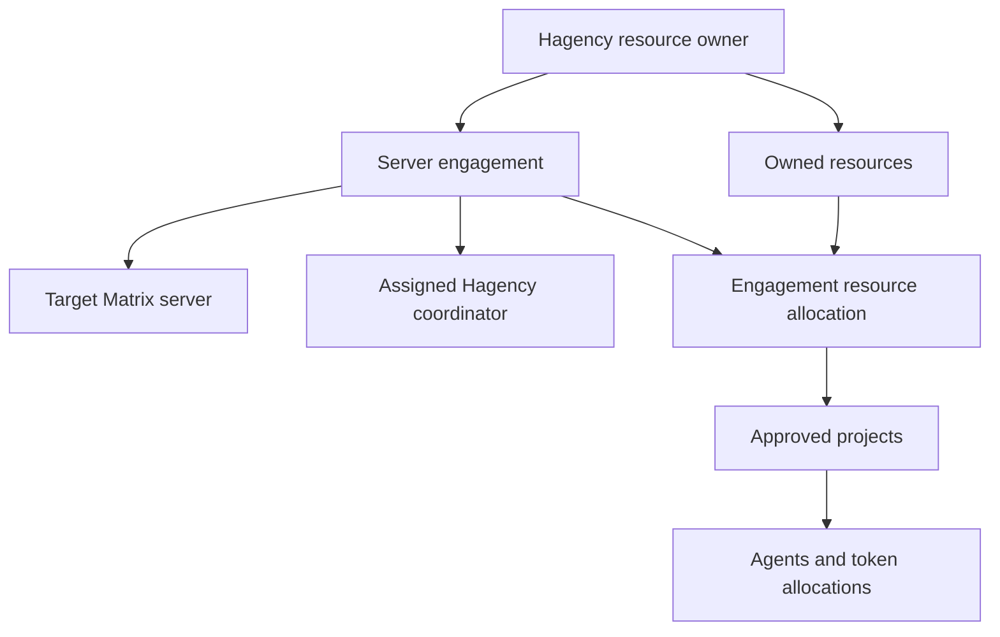

# ADR 0011: Hagency server engagements and coordinator approvals

- Date: 2026-10-03
- Status: Accepted product decision; implementation and deployment acceptance pending.
- Supersedes ADR 0010's Node.js backend retention, contribution initiation,
  configuration-export authority and project/agent approval model, including
  its subsequent designated-project-admin and assigned-project-admin amendments.
- Retains ADR 0010's Matrix login reuse, native credential custody, durable Inbox,
  notification behavior and distinction between approval and execution.
- Retains ADR 0009's shared reloadable theme and the OctoScript App Design Flow.

## Decision

Keep Palpo as the Matrix server and move its administration/workflow backend
from `web-admin/*.mjs` into Rust. Rinx remains a Rust/Makepad host with OctoScript
mini-app screens. Hagency's Rust runtime owns resources, reservations, provisioning
and measured usage. The existing Hagency web portal remains an operator surface
over the same runtime records; this decision does not require rewriting that UI.

The Matrix administrator approves a Hagency association with the homeserver.
The Hagency owner delegates an engagement-specific coordinator on that server.
The coordinator approves project requests and agent allocations through Rinx.
An authorized coordinator's mini-app approval is the only human approval needed
for an agent request. Hagency validates and executes it automatically, without
a second approval in its web portal. The portal shows the resulting agent and
decision, including provisioning failures and pending work.

All new workflow authority, accounting and decision handling belongs in Rust.
The Node service may remain operational during a staged migration but is not
the target implementation. A backend replacement must preserve existing Matrix
identities, projects, request IDs, decisions, credentials, spending and history.

## Vocabulary and ownership

| Concept | Meaning |
| --- | --- |
| Resource owner | The person/organization operating Hagency and supplying capacity |
| Resource | An owned model/runtime configuration, backed by an account/seat and explicit capacity period |
| Server engagement | One authorized relationship between a Hagency installation and a Matrix homeserver |
| Coordinator | A named Matrix user authorized by the resource owner to manage this engagement; a business role, separate from runtime bots |
| Engagement resource allocation | Capacity reserved from an owned resource for this engagement |
| Project | An approved project owned by a Matrix user, bound to an engagement and its permitted resources |
| Agent allocation | A grant to an agent within an engagement resource allocation |

Hagency currently calls an individual agent allocation an `Engagement`. Preserve
that legacy identifier and map it explicitly to `agentAllocationId`; introduce a
distinct `serverEngagementId`. Do not silently reinterpret existing engagement
IDs, or use a homeserver hostname as the new engagement primary key.

One installation supports multiple server engagements, including independent
engagements with the same homeserver. Each has its own profile, registration
generation, transport identity, coordinator delegation and connection proof.
Each project initially belongs to one server engagement. Multiple projects share
its allocated resources. Cross-engagement projects are outside this first delivery.



## Authority

| Action | Authority |
| --- | --- |
| Initiate a server engagement | Hagency owner through authenticated Hagency setup |
| Approve/reject the server association | One designated Matrix administrator with current server-admin authority |
| Assign/revoke a coordinator | Hagency owner; the runtime records the accepted delegation and its revision |
| Export an approved engagement profile | Designated Matrix administrator or explicitly authorized owner/coordinator, scoped to that engagement |
| Assign/increase resources to an engagement | Hagency owner; a coordinator only if the owner explicitly delegates this additional operation |
| Request a project | Eligible Matrix project manager |
| Approve/reject a project | Coordinator assigned to that server engagement |
| Request an agent or agent top-up | Authorized project owner/manager |
| Approve/reject an agent or top-up | Hagency owner or assigned coordinator, using their authenticated Matrix identity in Rinx |
| Provision, reserve tokens, meter usage | Hagency runtime, following the authorized decision |
| Execution/tool approval | Existing project-owner execution policy; independent of capacity approval |

Server administration, project ownership, Matrix room power levels, mini-app
consent and account display names do not imply coordinator authority. The resource
owner may act as coordinator by explicitly assigning its Matrix identity. All
roles are checked by the backend and rechecked when queued work executes. A user
with multiple assigned roles sees each surface; permissions remain explicit.

Store requester, project owner, resource owner, coordinator and deciding actor
separately. Approval targets a frozen request revision. A project owner cannot
approve merely because it owns the project. Requester/approver identity overlap
requires an explicit owner policy; default to refusing self-approval.

## Establish and configure an engagement

1. The owner obtains a coordinator account on the target Matrix server using its
   supported registration or invitation flow. Hagency must not assume arbitrary
   public registration or administrator credentials. The account is verified
   before it is bound to an engagement.
2. Hagency creates a pending engagement containing the target server, coordinator,
   owner and runtime identity. A public server connection profile may help start
   this request; it carries no resource grant or runtime credential.
3. The Matrix admin receives the association request in the Rinx Inbox and
   approves/rejects it. Approval authorizes this runtime association; it does not
   contribute compute or approve every future project.
4. After registration succeeds, the admin mini-app can download the approved
   engagement profile. Authorized owner/coordinator retrieval is also supported.
   It binds schema version, engagement ID, server identity/origin, runtime identity,
   coordinator binding, registration ID/generation and transport setup. Any secret
   is engagement-scoped and handled by the Rust host's export UI, never Splash or
   a Matrix notice. Prefer credentials encrypted to the requesting runtime key.
5. Hagency imports that profile into the matching engagement and tests the
   authenticated connection. Importing another engagement cannot replace the first.
   Reimport/rotation is generation-aware and preserves identity and history.
6. Both surfaces show **Connection verified** only after an exact authenticated
   probe succeeds for the current registration. Approval, import and verification
   are separate states. Retain the last proof time and current connectivity;
   an old successful proof does not imply the runtime is currently online.

There is one association approval. The public bootstrap profile and the approved
engagement profile are distinct stages, not reasons to request the same approval
twice. Once verified, the owner defines/selects resources for the engagement.
The underlying resource and account remain Hagency-owned.

`requested → approved → configuring → verifying → verified`

Expose rejected, retryable setup failures, suspended and revoked separately.
Revoking an association fences new work immediately but does not claim an offline
runtime has stopped. Existing agents, reservations and cleanup require reconciliation.

## Resources, projects and agents

The owner allocates bounded capacity to a verified engagement in Hagency. Only
that engagement's funded, published resources become requestable by eligible
project managers. A global resource catalog entry is not an allocation. Publish
allocation changes through a durable outbox with revision and observation time;
Palpo refreshes the mini-app promptly. Lost events recover through reconciliation.

A manager requests a project using these resources. Its coordinator decides in
Rinx. The project grant binds the owner, engagement, permitted resources and
revision. A project-level token sub-budget is optional; granting resource access
must not silently reserve the engagement's full budget again. Matrix room setup
continues under the appropriate owner authority and can resume after login.

Once the project is ready, its owner defines an agent and requests initial tokens.
The coordinator/owner reviews that exact request in the mini-app. Palpo commits
the decision, audit and outbound command atomically. Hagency checks the current
delegation, approved project, exact request and available capacity, durably
reserves tokens and provisions the agent. No additional human console approval
is inserted, including as a fallback for an old runtime.

```mermaid
sequenceDiagram
    participant P as Project owner in Rinx
    participant M as Palpo Rust workflows
    participant C as Coordinator in Rinx
    participant H as Hagency Rust runtime
    P->>M: Request agent for approved project and resource
    M-->>C: Durable Inbox action and Matrix notice
    C->>M: Approve exact request revision
    M->>H: Persisted authorized approval command
    H->>H: Recheck authority and reserve capacity atomically
    H-->>M: Reservation receipt and provisioning progress
    H->>H: Provision runtime and Matrix identity
    H-->>M: Readiness and membership evidence
    M-->>P: Agent ready; open chat
    Note over H: Same approved agent is visible in Hagency portal
```

`pending_coordinator → approved_waiting_hagency → provisioning → ready`

Distinguish rejected, allocation refused, provisioning failed, paused and retired.
Transport acknowledgement is not reservation or readiness. An offline runtime
leaves the approved decision pending for delivery. Changed/revoked delegation or
insufficient capacity produces an explicit refusal; neither triggers an automatic
increase, another approval queue, or a fabricated Ready state.

Commands bind version, command ID, operation digest, server engagement, registration
generation, delegation revision, project/grant revision, request revision, actor,
resource/agent allocation, amount and expiry. Retry identical commands after lost
replies; conflicting content with the same ID is refused. Persist execution
receipts before acknowledging them. The coordinator's scope is finite; the broad
Hagency console operator session is never exposed as a mini-app capability.

## Capacity and top-ups

Hagency is the reservation and consumption authority. Palpo's balance is a
versioned projection, never permission to allocate based on a stale UI value.

- Reserve engagement capacity from the underlying resource/account budget.
  Aggregate reservations across all engagements must fit that parent capacity.
- Reserve agent capacity inside its engagement resource allocation. Concurrent
  approvals/top-ups must not exceed it; check and reserve in one transaction.
- Use integer token counts with checked arithmetic and explicit account/resource,
  period and generation. Unallocated/unknown is not unlimited. Model configurations
  sharing an account must not promise the same account capacity independently.
- Track consumed capacity and outstanding reservations separately. Spending moves
  capacity from reserved to consumed; it does not free capacity for another agent.
  Retiring an agent returns only unused capacity after outstanding work and usage
  settle. Consumed tokens and late usage remain charged to the correct period.
- Keep project eligibility distinct from an optional project sub-budget to avoid
  charging the same grant twice at adjacent levels of the hierarchy.

For a settled budget period:

`engagement allocation = consumed + reserved unused + available`

Example: a 1M allocation grants 300k and 400k to two agents, leaving 300k available.
After the first spends 100k, available remains 300k. Retiring that first agent
after final metering returns its unused 200k, leaving 100k consumed, 400k reserved
and 500k available. It must not refund the spent 100k.

Allow both engagement and agent increases. Increasing an engagement consumes
available parent capacity and publishes the new revision. Increasing an agent
consumes that engagement's available capacity and retains the same agent and
usage history. Each uses a durable idempotency key. Neither operation silently
increases its parent. Refuse decreases below consumed plus outstanding capacity;
resource reclamation is a distinct explicit process.

Current native quota holds allow a running turn to finish. Admission limits can
be strict while observed execution consumption temporarily exceeds an allowance.
Do not advertise an absolute execution cap without per-call reservations and
provider-enforced output/usage bounds. Unknown metering preserves the reservation;
do not invent zero usage or refund unobserved capacity.

## Approved agents and consistent visibility

Every approved agent must have an operator-visible Hagency record once its
decision is delivered, before successful provisioning. Failure to reserve or
provision must remain visible. If Hagency is offline, Palpo retains the record
and shows delivery pending; Hagency materializes it when synchronization resumes.

Both the Rinx project-owner list and Hagency portal identify the same agent and
agent allocation. Show:

- Agent name, project, Matrix server and server engagement.
- Project owner, deciding coordinator/owner and approval time.
- Resource/model, requested and approved tokens.
- Approval, delivery, reservation, provisioning, readiness, pause/failure and
  retirement states; connectivity and observation time.
- Measured consumption, remaining allowance, measurement coverage and freshness.
  Unknown values say Awaiting usage data; they are not zero.
- Future extension: current job and recent/completed/failed job summaries. This
  field is explicitly unavailable until scoped runtime job reporting is delivered.

Palpo owns request/decision history; Hagency owns runtime and metering observations.
Visibility follows the project/engagement roles. Resource owners can inspect their
engagements; a manager cannot inspect other managers' private agents or jobs.
Retired agents remain in history. Ready requires runtime evidence and Matrix room
admission; a missing DM join is explicit setup work, not a hidden missing agent.

## User interface and notifications

Rinx offers role-aware areas: Server associations for the designated Matrix admin;
Engagement projects and Agent requests for the Hagency coordinator; My projects
and My agents for managers. All use the shared Rinx theme and existing login.
Desktop mini apps use their separate native window; mobile uses its supported
navigation surface. Platform support requires actual device acceptance.

Hagency Resources configures underlying capacity and its distribution. Server
engagements configures connections and allocated resources. Agent allocations
reviews each agent and its tokens. Resource and engagement screens may edit the
same allocation from opposite directions; they must not create two budgets.
Relabel the current individual-agent Engagements surface to remove the ambiguity.

Use the durable Inbox and personal My Actions Matrix room from ADR 0010. A notice
opens the latest authorized action. Dismissing a notice does not decide it; reminders
follow server policy while the action remains pending. Never include configuration
secrets in cards. Approval and runtime outcome notifications are separate events.

## Source findings and migration

Reviewed Hagency main: `e51a0b1385437c7b5e6893e68233b8173a0db018`.
Reviewed Palpo foundation: `8cff421`; Rinx foundation: `101cffc2`.
These are source baselines, not claims about current deployments.

1. Native Hagency's `bootstrap/palpo.rs::Live::import` rejects another fleet and
   uses singleton transport/appservice files. Introduce independent engagement
   profiles and supervised workers; isolate keys, generations and shutdown.
2. `domain/side_budget.rs` resolves budgets by server name using `LIMIT 1`.
   Change new operations to explicit engagement IDs, including same-server cases.
3. `domain.rs::check_grant` checks resource/account ceilings but does not consult
   `side_allocations`. The existing side-budget test approves before allocation.
   Enforce the engagement reservation in admission and top-up transactions;
   the displayed side budget is not evidence of that guarantee today.
4. Palpo's existing project grant stores resource IDs without reserved capacity.
   Add explicit coordinator delegation and the engagement resource ledger mapping.
5. Palpo's existing export is owner-only. Introduce the approved engagement export
   policy above without exposing broad credentials or changing unrelated exports.
6. Replace the Node-owned workflow store, sessions, authorization, decisions,
   Inbox/outbox, notifications and reconciliation with Rust service operations.
   Preserve the host contract where compatible; version changed roles and payloads.

Implement in these reviewable stages:

1. Rust contract: typed identities/states, coordinator authority, command/revision
   binding, rejection semantics and capability negotiation, with negative tests.
2. Hagency: engagement profiles, bounded parent/child ledger, idempotent decision
   receipts, automatic provisioning and approved-agent projections.
3. Palpo Rust: durable request/decision/outbox transactions, delegated approval
   routes, session reuse, association/export flow and notification reconciliation.
4. Migration: import legacy data with stable mappings and verified counts/digests;
   stop old writes before switching each workflow authority. Never let Node and
   Rust independently approve or reserve the same request. Audit existing budgets,
   roles and unknown consumption; preserve existing work without inventing grants.
5. Rinx: coordinator/admin/manager pages, resource revisions, agent details and
   authoritative chat navigation; real Makepad instrumentation and device tests.
6. Deployment: validate a copied database, restore/replay behavior and cutover,
   then retire the Node service after all supported paths pass. A rollback must
   preserve decisions made after migration; stale snapshot restoration is unsafe.

## Acceptance gates

- Two concurrent server engagements, including two on the same homeserver:
  distinct profiles, probes, coordinators, budgets and agents; restart/rotation
  of one cannot disconnect or retarget the other.
- Matrix admin approves association; the assigned Hagency coordinator approves
  project and agent in Rinx. Unassigned/cross-engagement users, project owners
  without delegation and stale/revoked roles are refused through every API path.
- One coordinator mini-app decision provisions the agent without a Hagency web
  approval. An older runtime advertises unsupported capability rather than
  silently reverting to console approval.
- Concurrent approvals for the last capacity, top-up replays, generation changes,
  offline commands and crashes never double-reserve or exceed parent/engagement
  limits. Spending/retirement/late observations cannot recreate consumed capacity.
- An engagement increase is visible to eligible managers; an agent top-up keeps
  the same identity/history. No parent budget is increased implicitly.
- Every approved agent appears in both views at the proper delivery/provisioning
  stage; unknown/stale usage and failures are visible. Ready agents join and reply
  in the project/owner rooms. Retired agents remain in history.
- Makepad instrument tests drive actual OctoScript screens for all roles,
  reminders, interrupted flows, theme reload, separate desktop windows and
  account isolation. Follow with live Palpo/Hagency E2E and mobile device evidence.
- Migration retains identities, pending/approved requests, receipts, budgets and
  usage. No old endpoint bypasses the new gates; no duplicate Node/Rust writer.

Future job summaries do not block this first acceptance. Their eventual release
requires scoped job observations and must not infer successful jobs from agent
online status. Merging this ADR is not evidence that these gates have passed.
