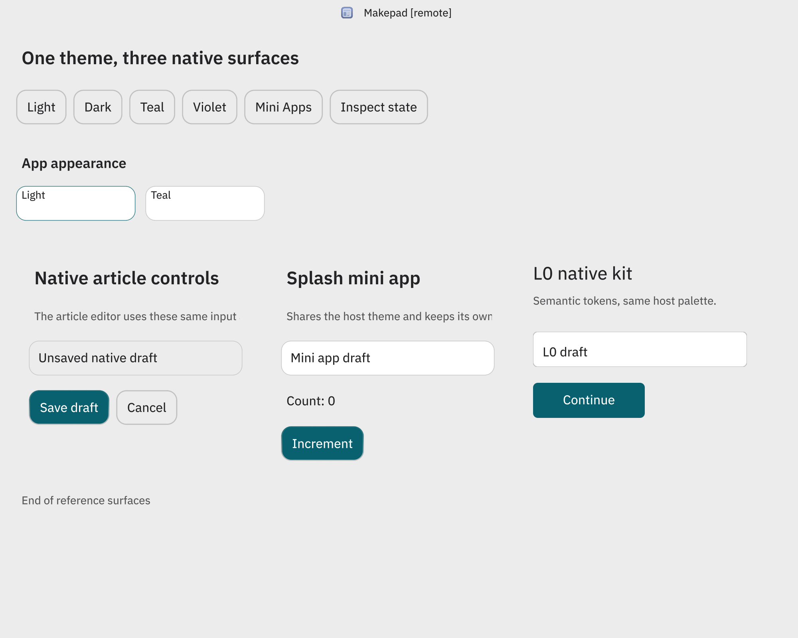
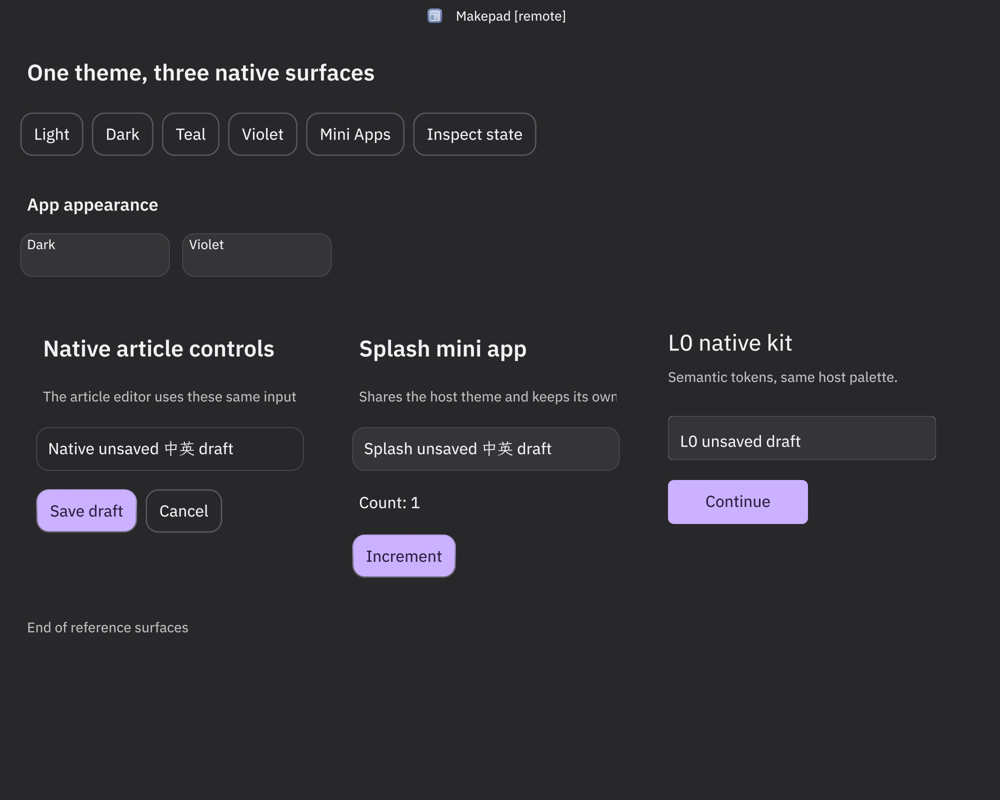
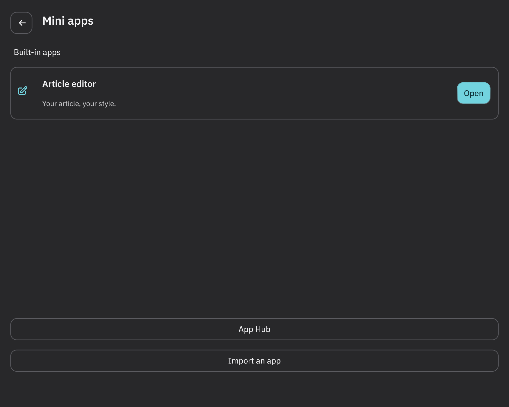
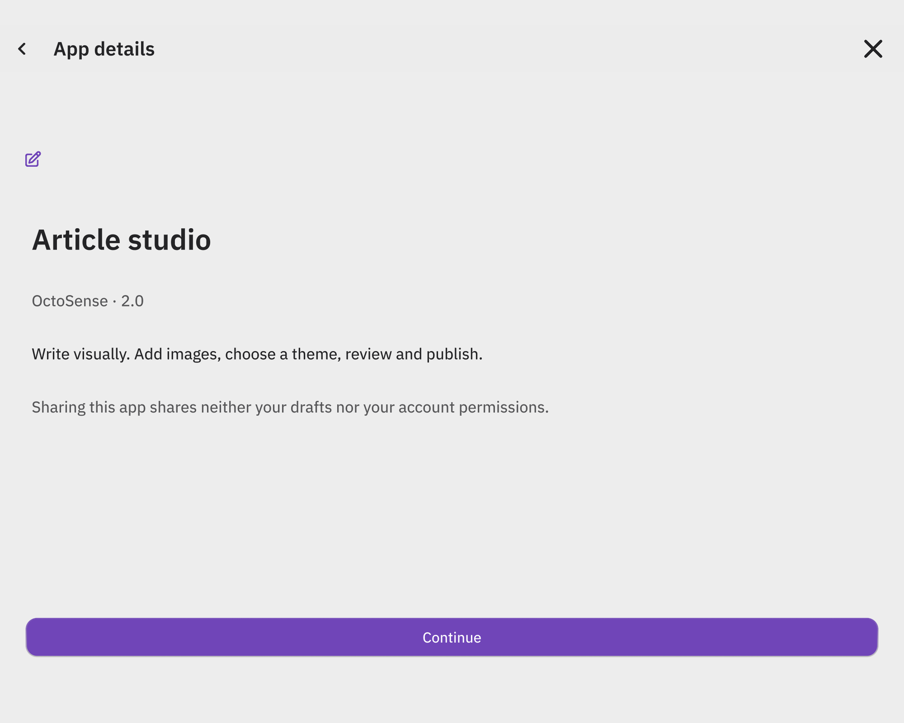
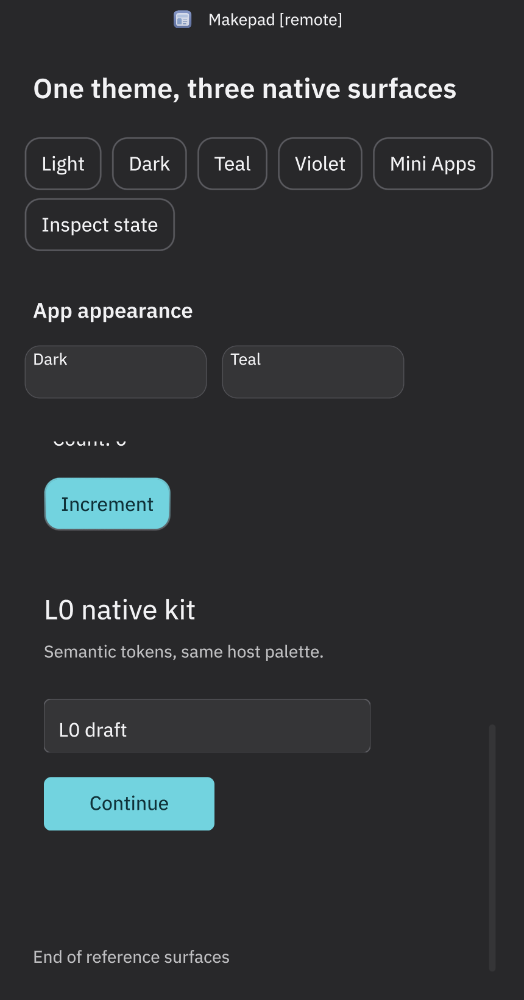

# Shared theme MVP

This implements the first vertical slice of [ADR 0009](adr/0009-shared-reloadable-themes.md).
The ADR was accepted in [Rinx #56](https://github.com/hagency-org/Rinx/pull/56).

## Behavior

- Standalone **Settings → App Settings → App appearance** offers light/dark and
  teal/violet accents. Selection is persisted separately in `appearance.json`.
  Hosted modules inherit OctoSense's Makepad stylesheet and do not read or write
  the standalone preference. The hosted settings display who owns appearance.
- Rinx registers both the stylesheet's theme and widget overrides. Per-VM
  semantic values and revisions feed common labels, inputs, buttons, surfaces,
  borders and compatibility aliases. No renderer fork or copied OctoSense
  preset catalog is introduced.
- The Mini Apps catalog, App Hub library/details, and native article controls use
  those roles. The catalog has an app card and an explicit primary Open action.
  The previously blank App Hub now opens correctly.
- Splash isolates inherit the stylesheet and shared controls. Semantic L0 native
  kits resolve recognized roles in memory through the pinned Octoscript API.
  Theme changes reconcile existing widgets instead of restarting the app.
- Article chrome follows appearance while authored document colors, content,
  history, grants and package identity remain unchanged.

## Reproduce the checks

```sh
cargo test --profile fast --locked --lib
cargo check --profile fast --locked --no-default-features --features octosense-module
cargo test --profile fast --locked --features octosense-module --lib theme_tests
cargo build --profile fast --locked --example theme_mvp --example system_app_catalog
python3 tools/wechat-ux/live/native_theme.py
python3 tools/wechat-ux/live/native_system_apps.py
python3 tools/wechat-ux/check_i18n.py
```

The Python tests launch actual Makepad/Metal windows with `MAKEPAD_HIDE_WINDOWS=1`,
`MAKEPAD_NO_FOCUS=1`, a fresh `RINX_DATA_DIR`, and a private loopback instrumentation
port. They use native clicks/keyboard/scroll events, capture PNGs and widget
bounds, and stop their own processes. They do not sign into Matrix or use the
running user's account. Results and input traces go under
`target/theme-mvp-validation/<run-id>/` and
`target/deployment-validation/system-apps-native/<run-id>/`.

The native `theme_mvp` example also runs visibly for inspection. Pass `--hosted`
to exercise injected host authority or `--narrow` for a phone-width layout.
See the [reference fixtures](../examples/miniapps/theme-reference/README.md).

## Validation coverage

| Check | Evidence |
| --- | --- |
| Light/dark and teal/violet within each appearance | Native screenshots and resolved-color assertions in standalone and hosted fixtures |
| Native, Splash and L0 unsaved input | Native typing, selection/focus and widget ID assertions through four live switches |
| L0 state and input undo | Native event dispatch and undo after switching |
| Mini-app lifetime and work | Stable isolate IDs, one startup request, one timer; increment requests occur only on clicks |
| Native article document | Actual `ArticlePanel` reapply test preserves source, selection, document history, authored style and virtual-list scroll |
| Catalog → App Hub → Article details | Native navigation and screenshots before/after live switching; signed-out authorization still enforced |
| Narrow layout and scroll | 430-point desktop window; native scroll coordinates preserved across a change |
| Contrast | All declared semantic text pairs tested at 4.5:1 across the four selections, including hover/pressed primary buttons |
| Localization | English/Chinese appearance strings; catalog checker and mixed English/Chinese native input |
| Hosted integration | Module-feature build, actual module-wrapper reapply regression test, and injected stylesheet/reapply fixture |
| Appearance settings and restart | Native dropdown interaction, persisted standalone selection, host ownership despite a conflicting local preference |

## Scope and remaining work

This is a migration MVP, not completion of ADR changes 1–6. Makepad's pinned
`StyleSheet` is the shared transport used here. Extracting a separately versioned
resolved-token crate with OctoSense, migrating every Rinx page and reader, and
the customer theme editor/import/export/preview/undo experience remain follow-up
work. Existing fixed Rust colors and unconverted pages are not fully themed.

Classic L0 kits retain their authored palettes. Native measured kits retain their
fonts and geometry; the MVP adapts semantic colors and corner radius. Legacy
Splash authors must guard startup effects before claiming replay-safe restyling.
System appearance tracking is not exposed by the pinned Makepad platform API,
so this MVP exposes explicit light/dark choices.

The native results are macOS instrumentation. Phone-width captures are not
Android or OpenHarmony device validation. Running inside the installed OctoSense
shell, platform keyboards/IME, accessibility, and mobile device interactions
remain separate integration checks.

## Recorded desktop run

On macOS 26.6.2 / arm64, the feature-inclusive library suite passed **313 tests**
with **2 ignored**. Both native suites passed in standalone and hosted modes;
restart recovery, production appearance dropdowns, and narrow scrolling passed.
The module-only build and localization check also passed. The checked-in
[result manifest](theme-mvp-validation.json) records the native binary digest and
local evidence locations. CI includes the module-wrapper regression test.

These are captures of the actual native windows. The L0 sample consumes the
same palette while retaining its kit's font and measured geometry.






