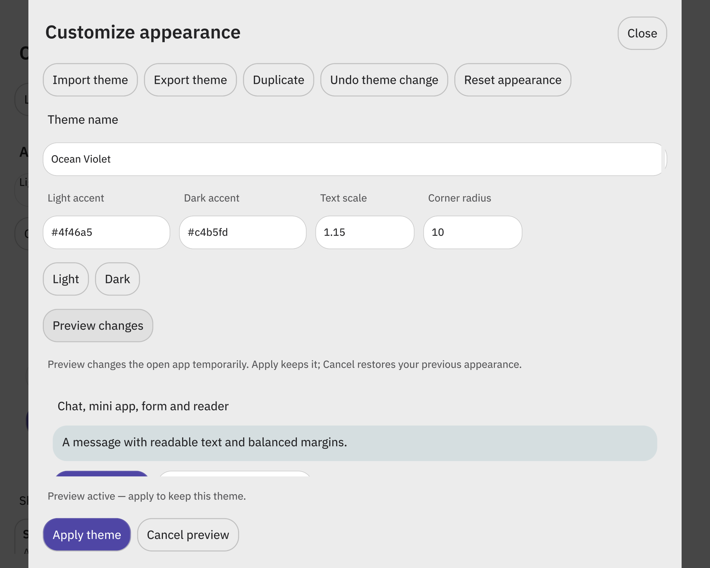
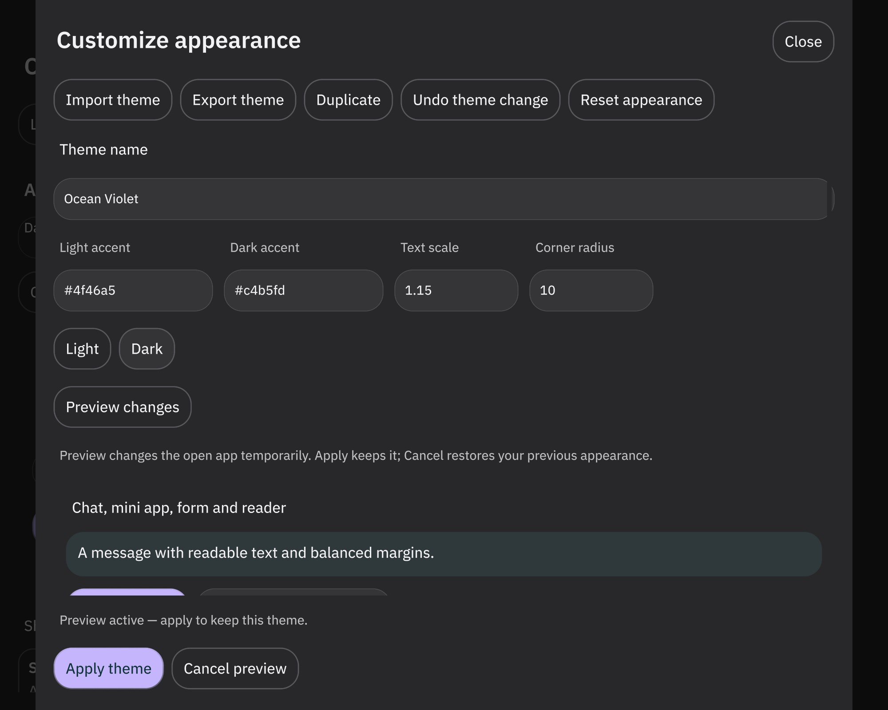
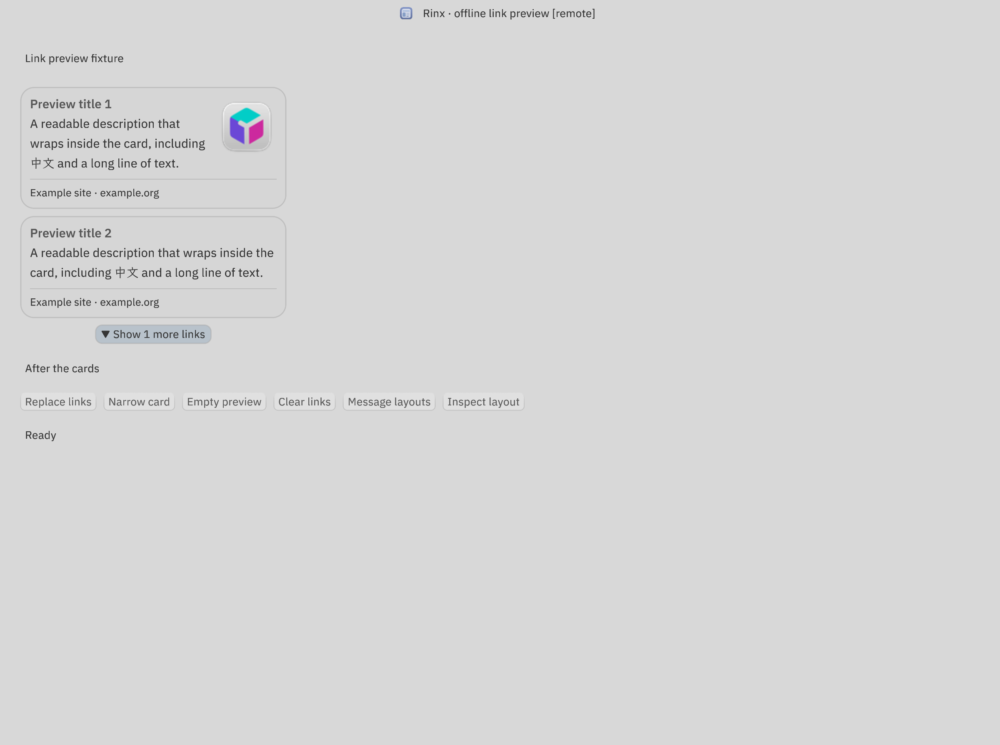
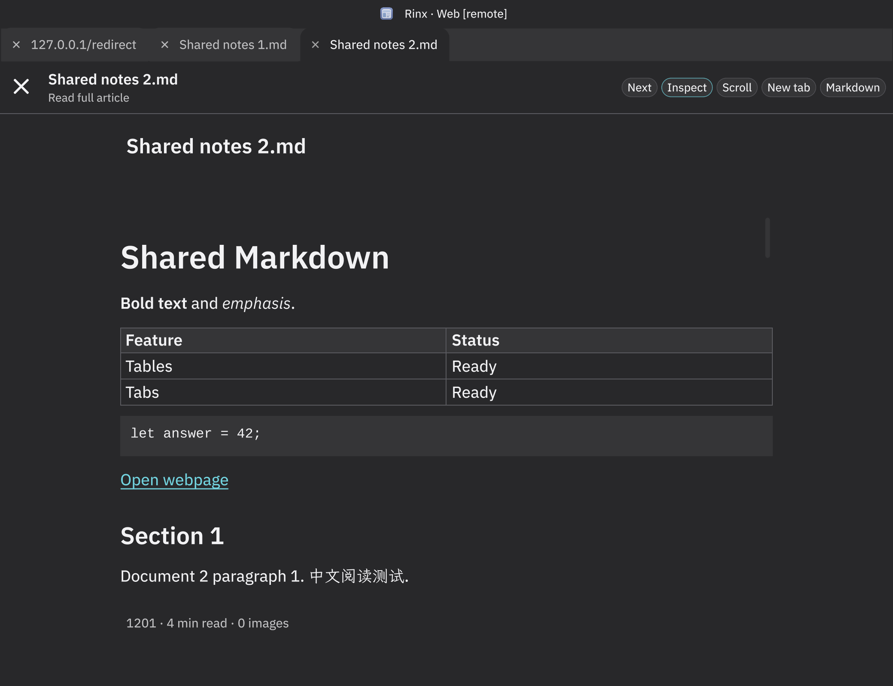

# Shared customer themes: implementation and validation

This extends the [MVP record](theme-mvp.md) and implements the Rinx portions of
[ADR 0009](adr/0009-shared-reloadable-themes.md). The [customer guide](customer-themes.md)
documents file format, UI and compatibility boundaries. The complete ADR's
cross-platform release criteria are not all satisfied by this macOS run.

## Delivered behavior

- A renderer-independent versioned theme contract validates data, resolves
  inherited tokens/references and light/dark variants, computes revisions, and
  emits trusted Makepad definitions or owned-HTML CSS variables.
- Standalone Rinx supports customer `.octotheme` files, basic/JSON editing,
  duplicate, preview, cancel, apply, undo, reset, import, export and Matrix
  attachment sharing/review. An interrupted apply recovers the known-good theme.
- Hosted instances retain OctoSense authority. The existing complete stylesheet
  path still works; a validated data-snapshot receive API is also available.
- Native pages, shared controls and cached drawing values consume semantic
  roles. Retained cards, popups, reactions, send indicators, reader tabs and
  secondary windows refresh on reapply. A source guard rejects unexplained
  interface color literals.
- Splash and opted-in L0 kits inherit the theme without replacing their
  instances, replaying guarded startup work or modifying bundle identity.
- URL-card titles/descriptions and native body text share 11 logical font units
  at normal scale (12.65 at 115%). Titles remain bold; metadata uses 9.5.
- Plain Markdown follows app paper/ink/link/code defaults. Authored articles
  preserve document style, and external WebKit pages retain their own CSS.
  Native readers use the shared bounded reading width and balanced gutters.
  Explicit table layout defaults and a code-ink uniform keep table geometry
  and code contrast correct after a live theme change.

## Reproduction

The native tests use the actual Makepad remote instrumentation, hidden macOS
windows, native rendering, pointer/keyboard input, widget measurements and
screenshots/OCR. They are not screenshots generated from mock HTML. Each run
uses an isolated offline profile; no production Matrix account or room send is
needed. `target/fast`, not an older `target/debug`, is the tested binary path.

```sh
cargo test --locked --manifest-path crates/theme-contract/Cargo.toml
cargo test --profile fast --locked --features octosense-module --lib
cargo check --profile fast --locked --no-default-features --features octosense-module
cargo check --profile fast --locked --features tsp
cargo build --profile fast --locked --example theme_mvp --example chat_web_browser --example chat_link_preview --bin rinx
python3 tools/wechat-ux/live/native_theme.py
python3 tools/wechat-ux/live/native_theme_packages.py
python3 tools/wechat-ux/live/native_chat_link_preview.py --binary target/fast/examples/chat_link_preview
python3 tools/wechat-ux/live/native_chat_web_browser.py --binary target/fast/examples/chat_web_browser --desktop
python3 tools/check_theme_literals.py
python3 tools/wechat-ux/check_i18n.py
cargo build --release --locked
python3 tools/wechat-ux/live/native_theme_release.py
```

The scripts write a result/report JSON, binary hashes where relevant, screenshots,
native logs and input traces under the corresponding `target/*validation` or
`target/*regressions` directory. Native prerequisites are documented beside the
existing [probe](../tools/wechat-ux/live/native_probe.py).

## Results: macOS, 2026-10-03

The [machine-readable record](theme-validation.json) contains the run directories,
reported binary SHA-256 values and screenshot hashes.

| Check | Result |
| --- | --- |
| Rinx library with `octosense-module` | 318 passed, 2 ignored |
| Portable theme contract | 7 passed |
| Module-only and optional TSP builds | Passed `cargo check` |
| Original native theme suite | Standalone and hosted revisions, drafts, selection/focus/undo, stable isolates, one startup request/timer, catalog/article flow, persistence and narrow scroll passed |
| Customer-theme native suite | Import without apply, both previews, contrast rejection, cancel/apply/undo, retained notifications, restart, interrupted-apply recovery, narrow editor and typed hosted delivery passed |
| Actual chat-card fixture | All 8 layout, content, navigation and reuse checks passed |
| Actual tabbed-reader fixture | All 21 checks passed, including retained tabs/scroll/website state, balanced bounded reading width, tables after reapply, and sampled code foreground/background pixels |
| Optimized release | Built; actual signed-out Rinx started with isolated light/dark custom-theme profiles, retained the selected package and produced native frames without script/shader errors |
| Source checks | Theme-literal guard and diff whitespace checks passed; 1,229 i18n entries, 1,160 translated call sites, no missing entries |

The native package fixture measured UI body, card title and card description at
`[11, 11, 11]`, then `[12.65, 12.65, 12.65]` after 115% text scaling. It also
checks that the same widget identities and edited values survive the change.






## Remaining integration and release gates

- The portable crate lives in Rinx's source tree and is ready for other hosts
  to depend on. OctoSense has not yet adopted it in its own dependency graph.
  Two isolated hosts are covered in Rust tests; native fixtures cover hosted
  reapply, not a deployed OctoSense shell running two signed-in Rinx accounts.
- No separate Android APK/OpenHarmony process snapshot/subscription transport
  is shipped here. `theme::host::receive` is the consumer boundary, not IPC.
- Desktop System detection is implemented. Android configuration events have
  a source adapter but require a device build/run. System adapters for
  iOS/OpenHarmony/Web remain open; those builds expose explicit appearance.
- The macOS run does not prove Windows/Linux/Android/iOS/OpenHarmony/Web UI,
  mobile pickers/sharing, device touch interaction, accessibility or IME
  composition. Text/selection/focus and Chinese/English fixtures are narrower
  evidence than a platform accessibility review.
- Matrix theme sharing uses the SDK attachment/encryption path, but a real
  encrypted-room send/download/decrypt roundtrip was not performed. Tests inject
  the same import action after validation, and verify receiving does not apply.
- Legacy literal design kits keep their authored palettes. New semantic kits
  must opt in. The generic renderer and installed bundle bytes are unchanged.
- V1 admits host `system`/`mono` fonts and retains host SVG resources; it does not
  load uploaded font/icon binaries. Marketplace publication, account theme sync
  and organization policy remain separate ADR scope.

Do not interpret this delivery or a green macOS fixture as completion of these
remaining platform/host release gates.
